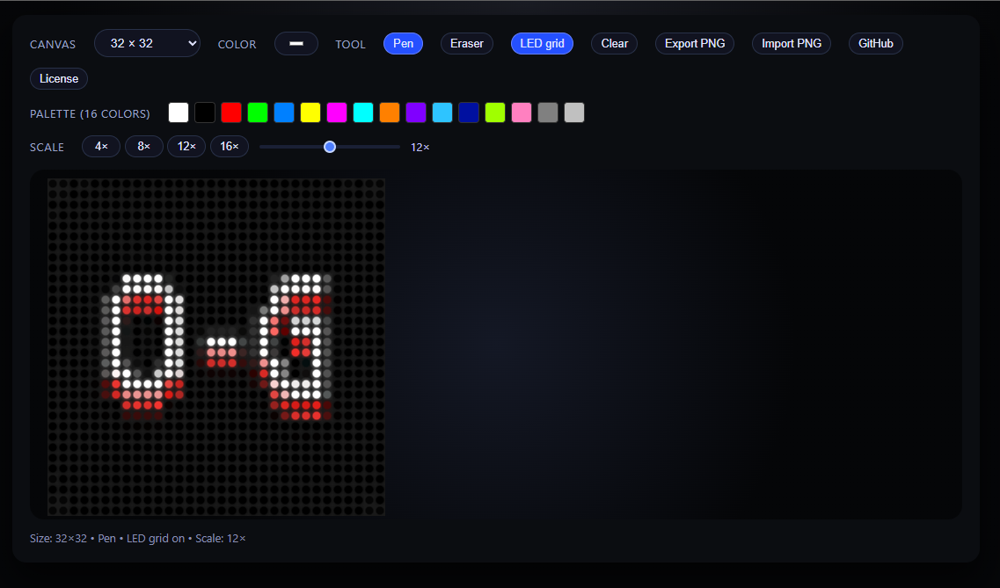

# iPixel PNG Editor

A lightweight, browser-based editor for creating pixel-perfect PNG icons for all **iPixel LED matrix formats**.  
Designed to run 100% offline as a single HTML file — no installation required.

---

## 🚀 Features

### 🎨 LED-style Pixel Editor
- Edit pixels in a clean **LED-grid layout**
- Adjustable grid scale (4× to 20×)
- Rounded LED preview
- True RGB colors for iPixel compatibility

### 🖼 Import & Export
- Import any PNG (matching matrix size)
- Export clean, optimized iPixel-ready PNG files
- Preserves original pixel values
- Automatic background handling

### 🔧 Supported Matrix Formats
The editor supports all common iPixel static PNG sizes:

- **16×16**
- **32×8**
- **32×16**
- **32×32**
- **48×16**
- **60×16**
- **64×16**
- **64×20**
- **64×32**
- **80×16**
- **96×16**
- **128×16**
- **192×16**

(Extra formats can easily be added.)

---

## 📦 Included in this Project
- Full standalone HTML editor  
- Favicon set (ICO + PNG)  
- Rounded app icons (192×192 + 512×512)  
- Example PNG files for all matrix formats  
- MIT License  

---

## 🛠 How to Use
1. Download or open `ipixel_editor.html`  
2. The editor runs instantly — no installation required  
3. Draw, import, or modify your pixel image  
4. Export as clean PNG compatible with iPixel devices  

Runs on:
- Windows  
- macOS  
- Linux  
- Android  
- iOS  
- Any modern browser  

---

## 📘 License
This project is released under the **MIT License**, allowing free usage, modification, and distribution.

---

## 🧱 Support / Contributions
This project is provided **as-is** without guarantees.  
Contributions are welcome but not required or expected.

---

## 👤 Author
Created by **opa-gamert**  
GitHub: https://github.com/opa-gamert
